# Disentangling EmbEdded Z-Latents

## Abstract
In this paper, I describe a method of disentangling Variational Autoencoder (VAE) latent channels into semantic channels and style channels using Constrastive Language-Imaging Pre-training (CLIP) text and image embeddings.

## Introduction

A VAE encodes images into latent vectors, and decodes latent vectors into images.
An important property of the inputs/outputs of a VAE is that compared to the input images, the latent vectors have more channels, but less spatial information. For example, the Stable Diffusion XL (SDXL) VAE reduces the height/width of an image by a factor of 8, while adding an extra channel (e.g. a $3\times600\times400$ image has a latent representation of $4\times75\times50$, wherein the dimensions correspond to $channels\times height\times width$)

I hypothesize that each channel in the latent vector contains both semantic and style information.
Furthermore, I hypothesize that the semantic and style information can be separated with a linear transformation.
Conceptually, this would be a change of basis transformation as depicted below.

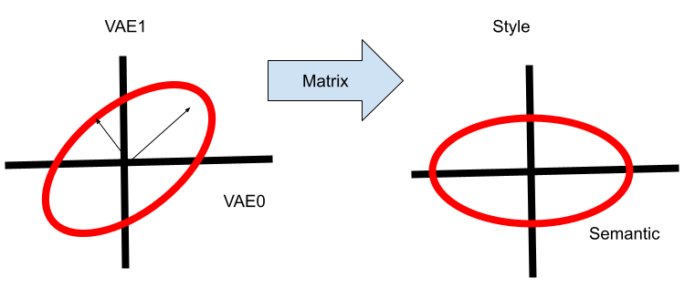

In other words, I hypothesize there exists a linear transform that "unmixes" the semantic and style information in each VAE latent channel into separate semantic and style channels.

Thus, there should be a $channel \times channel$ matrix that can represent this transform. For ease of use, this matrix should:
1. Be invertible, so that semantic and style information can be independently generated, and fed back into the VAE for decoding
2. Preserve the VAE objective for the semantic and style channels. The VAE objective is to make each latent vector lie within $\mathcal{N}(0, I)$ which makes the latent space smooth. This feature of the latent space is useful for a variety of applications described below.

An [orthogonal](https://en.wikipedia.org/wiki/Orthogonal_matrix) matrix, $Q$, would satisfy these two goals:
1. $Q$ always has an inverse, $Q^T$
2. $Q$ preserves the VAE objective:
    - $Q\mathcal{N}(0, 1) = \mathcal{N}(Q0, QIQ^T)$ ([proof](https://math.stackexchange.com/questions/3632700/multiply-normally-distributed-random-vector-by-a-matrix))
    - $=\mathcal{N}(0, QQ^T)$
    - $=\mathcal{N}(0, I)$ if $Q$ is orthonormal

In summary, the objective is: **find an orthogonal matrix, $Q$, that separates the channels of a VAE into semantic channels and style channels**

## Method
My method involves three trainable modules:
1. An **invertible linear module**, that:
   1. encodes VAE channels to semantic and style channels 
   2. decodes the semantic and style channels into VAE channels
2. Two **image embedders**. One inputs only the semantic channels output by the invertible linear model, and the other inputs only the style channels. The image embedders consist of:
   1.  multiple [ConvNeXt](https://arxiv.org/abs/2201.03545) style blocks that reduce the spatial dimensions by half, and double the number of channels.
   2.  an average pool and linear layer head

The invertible linear module is the final goal.
The image embedders provide a way for the module to learn to separate the semantic and style information based on the following losses.

### Losses
To achieve the orthogonal objective, the following loss is minimized:

$$MSE(Q^TQ, I)$$

Where:
- $Q$ is the weight of the invertible linear model
- I is the identity matrix, and
- MSE is a mean squares error loss.

For the image embedders, the following loss is minimized:

$$MSE(semantic, embedder_{semantic}(sem_z)) + MSE(style, embedder_{style}(style_z))$$

Where:
- $sem_z$ and $style_z$ are the semantic and style channels of the latent space
- $embedder_{semantic}(sem_z)$ and $embedder_{style}(style_z)$ represent the model outputs of applying the semantic image embedder and style image embedder on the semantic channels and style channels respectively
- $semantic$ and $style$ represent ground truth semantic and style embeddings derived from CLIP (see procedures for description)

### Procedure
(dataset preprocessing) For each `image, caption` pairing in the [dataset](https://huggingface.co/datasets/romrawinjp/mscoco), store:
   - `z`, the VAE latents of the image
   - `clip_txt`, the normalized CLIP text embedding of the caption
   - `clip_img`, the normalized CLIP image embedding of the image

The VAE and CLIP models can then be unloaded to save VRAM (helps my 3060ti). To further save VRAM, instead of the full SDXL vae, I used [TAESD](https://github.com/madebyollin/taesd), which is a distilled version.

To train, for each `z`, `clip_txt`, and `clip_img` batch:
1. Calculate `x = invertible_linear.encode(z)`
2. Separate `x` into `sem_z` and `style_z` tensors along the channel dimension. For example, my `z` tensors had 4 channels, and I split them into 2 `sem_z` channels and 2 `style_z` channels
3. Calculate `embedder_semantic(sem_z)` and `embedder_style(style_z)`
4. The ground-truth `semantic` embedding is just `clip_txt`. The ground-truth `style` embedding is `clip_img - clip_txt`. For empirical evidence that the style embedding works, see [`InstantStyle` by Wang et. al.](https://arxiv.org/abs/2404.02733)
5. Using the above, you can calculate and minimize the above losses.

As a final step, calculate a [$QR$ decomposition](https://en.wikipedia.org/wiki/QR_decomposition) of the weight of the invertible linear layer, and replace the weight with $Q$.
$Q$ is guaranteed to have normalized column vectors, and in my experience $R$ is usually pretty close to $I$ anyways.

## Evaluation

### Original Images
<table>
    <tr>
        <td>
            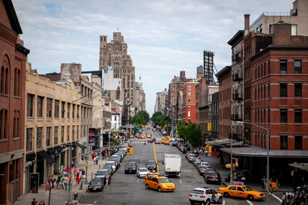
            
Original
                <a href="https://negativespace.co/city-street-urban/">CC0 from Bango Architecture & Design</a>
            

        </td>
        <td>
            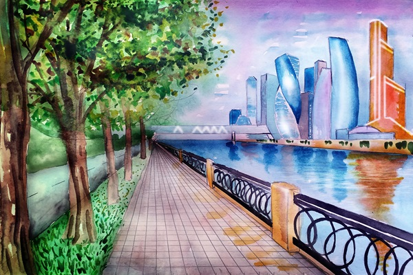
            
Target
                <a href="https://commons.wikimedia.org/wiki/File:Moscow_city_art.jpg"> CC from Viktoria Borodinova</a>
            

        </td>
    </tr>
</table>

### Qualitative Results of Lerping Channels
Each lerp corresponds to replacing the specified channels with a mix of 90% target image and 10% original image.
The semantic/style lerps apply the lerp after multiplying the VAE channels by $Q$.
The other lerps apply the lerp directly in the VAE's untransformed latent space.
<table>
    <tr>
        <td>
            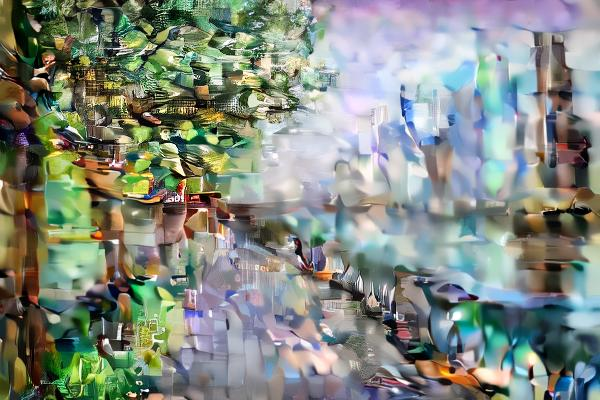
            
Semantic lerp

        </td>
        <td>
            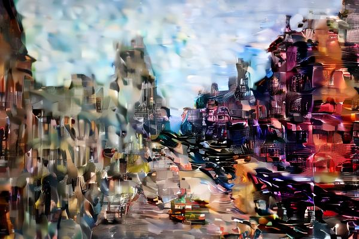
            
Style lerp

        </td>
    </tr>
    <tr>
        <td>
            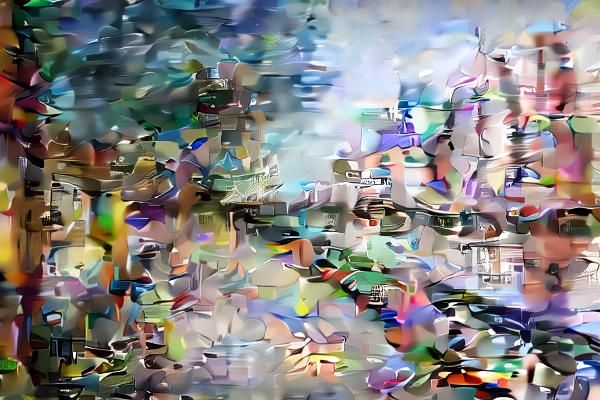
            
VAE 0-3 lerp

        </td>
        <td>
            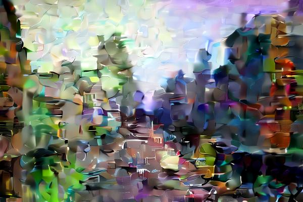
            
VAE 1-2 lerp

        </td>
    </tr>
    <tr>
        <td>
            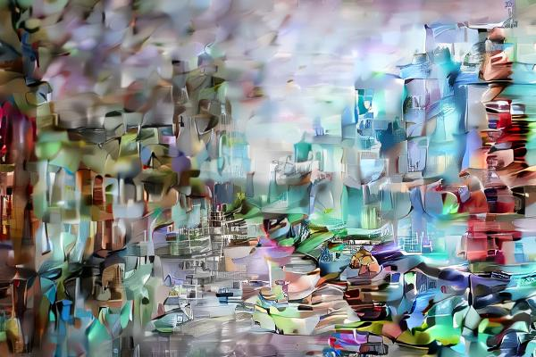
            
VAE 0-1 lerp

        </td>
        <td>
            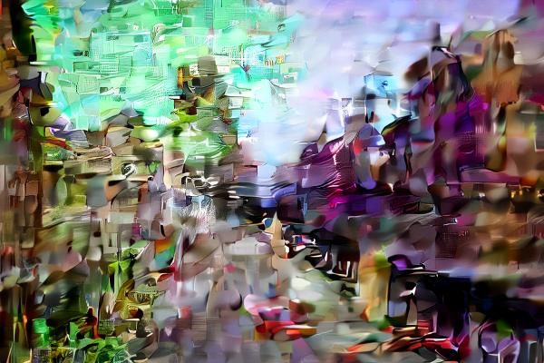
            
VAE 2-3 lerp

        </td>
    </tr>
    <tr>
        <td>
            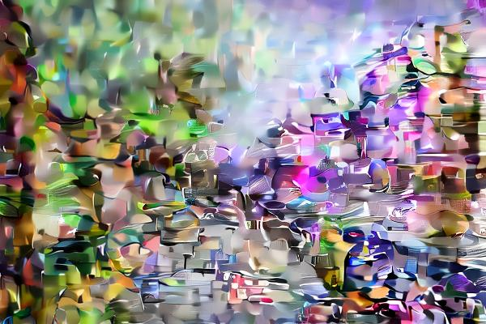
            
VAE 0-2 lerp

        </td>
        <td>
            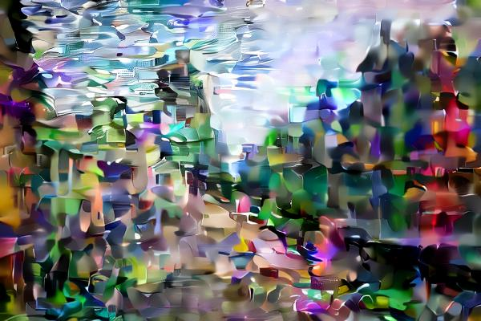
            
VAE 1-3 lerp

        </td>
    </tr>
</table>

Empirically, note that the semantic lerp clearly places the trees and buildings in the distance of the target into the image. The style lerp preserves the buildings of the original image, but has recolored one building on the right orange, which matches one of the buildings in the target image.

The closest competitor is the 0-3/1-2 VAE lerp. However, in 0-3 the leaves of the tree are less well defined, and the fence is destroyed. And, in the 1-2 lerp, the green from the trees colors the buildings, and the taxi is destroyed.

## Further work
I started work on this model because it is one step in a larger goal of more closely aligning AI art generation with human artists.

Take the below sample sample output from Stable Diffusion from [Jay Alammar](https://jalammar.github.io/illustrated-stable-diffusion/):

Note that the model diffuses in both the semantic and style spaces simultaneously. Trees and mountains fade in and out, and the color of the sky/weather change too.

In contrast, a human would have locked down the semantic aspects of the image (e.g. how many trees, what the whether would be) before coloring and adding style information. In other words, we humans would start with a sketch (hence the repo name "sketch autoencoder").

By preserving the VAE objective with the orthogonal matrix, and clearly separating the semantic and style channels, I propose that a better image diffusion model can be created.
This model would first diffuse only the semantic channel, and then diffuse the style channels.
The benefits would be:
1. Control: a user can make the semantic information static, and force the model to only change style information
2. Feedback: a user can cheaply diffuse only in the semantic space before picking one good candidate to diffuse in the style space
3. Speed: an accelerated denoising schedule can be used to diffuse in the semantic space, so further denoising can focus on adding better style information

Alas, all I got is a 3060ti, so I won't be able to train such a model.
