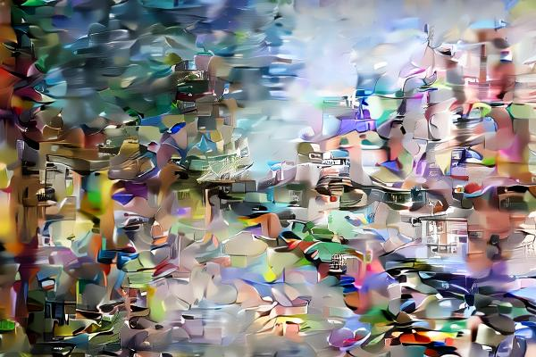

# Disentangling EmbEdded Z-Latents

## Abstract
In this paper, I describe a method of disentangling Variational Autoencoder (VAE) latent channels into semantic channels and style channels using Constrastive Language-Imaging Pre-training (CLIP) text and image embeddings.

## Introduction

A VAE encodes images into latent vectors, and decodes latent vectors into images.
An important property of the inputs/outputs of a VAE is that compared to the input images, the latent vectors have more channels, but less spatial information. For example, the Stable Diffusion XL (SDXL) VAE reduces the height/width of an image by a factor of 8, while adding an extra channel (i.e. a $3\times600\times400$ image has a latent representation of $4\times75\times50$, wherein the dimensions correspond to $channels\times height\times width$)

I hypothesize that each channel in the latent vector contains both semantic and style information.

## Method

## Evaluation

### Original Images
<table>
    <tr>
        <td>
            
            
Original (Left image)
                <a href="https://negativespace.co/city-street-urban/">CC0 from Bango Architecture & Design</a>
            

        </td>
        <td>
            
            
Target (Right image)
                <a href="https://commons.wikimedia.org/wiki/File:Moscow_city_art.jpg"> CC from Viktoria Borodinova</a>
            

        </td>
    </tr>
</table>

### Qualitative Results of Lerping Channels
Each lerp corresponds to replacing the specified channels with a mix of 90% target image and 10% original image.

<table>
    <tr>
        <td>
            
            
Semantic lerp

        </td>
        <td>
            
            
Style lerp

        </td>
    </tr>
    <tr>
        <td>
            
            
VAE 0-3 lerp

        </td>
        <td>
            
            
VAE 1-2 lerp

        </td>
    </tr>
    <tr>
        <td>
            
            
VAE 0-1 lerp

        </td>
        <td>
            
            
VAE 2-3 lerp

        </td>
    </tr>
    <tr>
        <td>
            
            
VAE 0-2 lerp

        </td>
        <td>
            
            
VAE 1-3 lerp

        </td>
    </tr>
</table>

